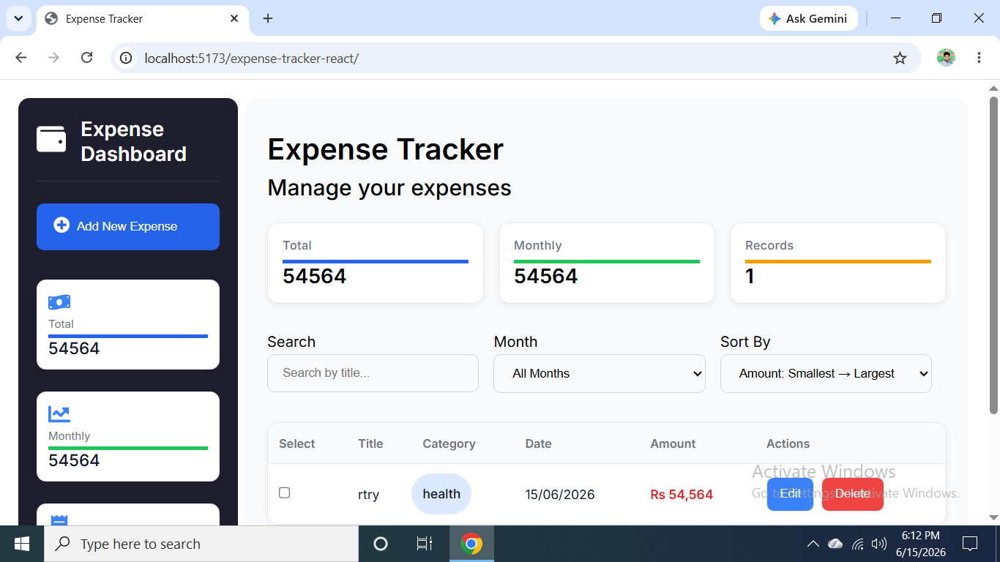

## Expense Tracker (React Version)

# Live Demo

https://rafeeqhassani.github.io/expense-tracker-react/

# Source Code

https://github.com/rafeeqhassani/expense-tracker-react

# Desktop View

# Mobile View

# About the Project

A React-based Expense Tracker Application built to manage daily and monthly expenses with dynamic UI updates, filtering, sorting, validation, and persistent LocalStorage storage.

This project focuses not only on building features but also on understanding frontend architecture, React state management, UI behavior, rendering flow, debugging, and real-world application structure.

The project was originally built in Vanilla JavaScript and later refactored into React to better understand component-based architecture and state-driven UI design.

# Features

- Add, edit, and delete expenses
- Load More pagination (40 items per batch)
- Search expenses by title
- Sort expenses (alphabetical & numeric)
- Filter expenses by month
- Bulk selection & removal
- Real-time total calculation
- Dynamic category management
- Form validation
- LocalStorage persistence
- State-driven UI rendering
- Responsive behavior

# Technologies Used

- React
- JavaScript (ES6+)
- CSS3
- HTML5
- React Hooks (useState, useReducer, useEffect)

# Project Architecture & Learning

This project helped me deeply understand:

## React Architecture

- Component-based structure
- Separation of UI and business logic
- Scalable project organization
- When abstraction is actually needed

Complex form logic was handled using `useReducer`, while simpler logic (filtering, pagination, totals) was kept modular without over-engineering.

# State Management Understanding

## UI State

- Form open/close state
- Mode (add/edit)
- Editing ID
- Validation errors
- Toast notifications

## Data State

- Expenses array
- Categories
- Filtered results

## App Flow

Understanding how UI changes based on user actions, reducer transitions, and rendering conditions.

# Form Complexity & Reducer Logic

The form was managed using `useReducer` due to multiple connected states:

- formData
- errors
- mode
- editingId
- isFormOpen

Key learnings:

- reducer-driven state flow
- event-based UI updates
- centralized state transitions
- conditional UI behavior

A key principle learned:

> A single submit action should produce a single clear UI outcome.

During debugging, inconsistent validation and success messages were caused by overlapping UI states rather than data issues.

Closing the form after successful submission ensures a clean UI state and prevents conflicting feedback.

# UI State Debugging & Form Lifecycle Decisions

During form submission, validation messages sometimes appeared alongside success toasts.

I investigated the issue by:

- Traced reducer actions step by step
- Inspected state transitions before/after submit
- Verifying validation flow
- Adding console logs to confirm state correctness
- Reviewing render behavior and UI updates

The data flow was correct, but the issue appeared to be related to UI lifecycle timing and overlapping render status when the form remained open after submission.

### Solution

Closing or resetting the form after successful submission ensured:

- Fresh state on each open
- No stale validation messages
- No overlapping UI states
- More predictable rendering behavior

This helped stabilize the UI while keeping validation logic intact.

### Key Learning

> UI bugs are not always logic errors — they often come from state lifecycle and rendering synchronization issues.

# Problem Solving & Debugging

This project involved deep debugging and architectural decisions:

- Tracing rendering flow
- Debugging state transitions
- Understanding async behavior
- Fixing UI conflicts
- Using DevTools effectively
- Finding root causes, not just symptoms

# What I Learned

## Vanilla JavaScript

- DOM manipulation
- Event handling
- Dynamic rendering
- LocalStorage sync

## React

- State-driven UI
- useReducer architecture
- Component responsibility
- Derived state handling
- UI lifecycle management
- Scalable project structure

# Future Improvements

- UI/UX redesign
- Analytics charts
- Dark mode
- Export (CSV/PDF)
- Backend integration
- Authentication
- Database support

# Project Status

Core functionality is complete.

Current focus:

- UI improvements
- Architecture refinement
- Scalability
- Advanced React patterns

# Note

This project was built through consistent self-learning, debugging, and experimentation.

The goal was not only to implement features but to understand how frontend applications behave internally — especially state flow, UI rendering, and reducer-driven architecture.
