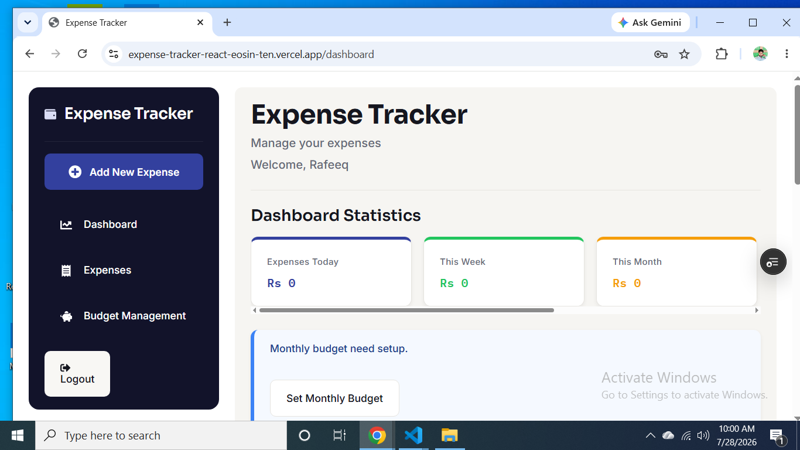
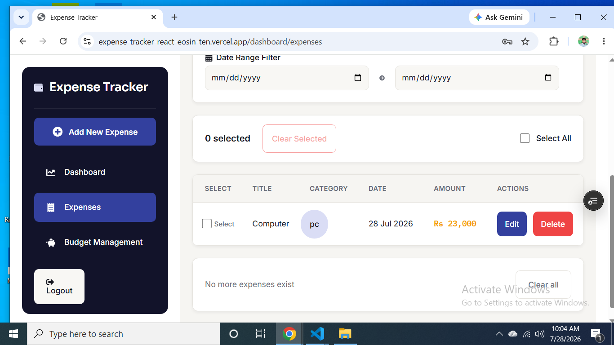
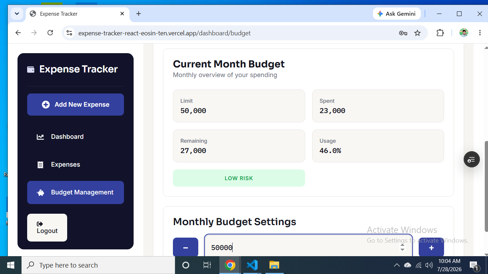
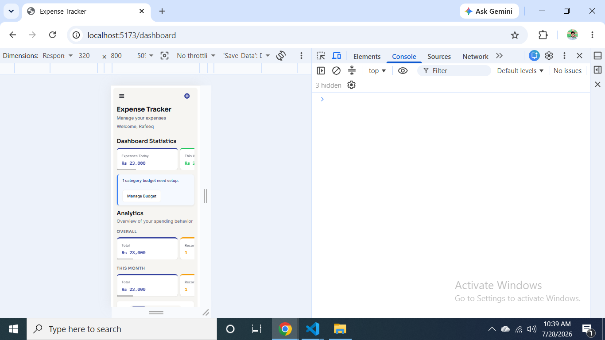

# Expense Tracker React

A full-stack responsive expense management application built with React.js and REST API integration.

## Live Demo

[https://expense-tracker-react-eosin-ten.vercel.app/](https://expense-tracker-react-eosin-ten.vercel.app/)

## Source Code

[https://github.com/rafeeqhassani/expense-tracker-react](https://github.com/rafeeqhassani/expense-tracker-react)

---

## Screenshots

### Desktop View

### Mobile View

---

## About The Project

Expense Tracker is a full-stack personal finance application designed to manage daily expenses, analyze spending patterns, and provide a structured dashboard experience.

The frontend was built with React.js and communicates with a backend REST API for data management and persistent storage.

The project was originally developed using Vanilla JavaScript and later rebuilt using React to improve component architecture, state management, scalability, and maintainability.

---

## Features

### Expense Management

- Add, edit, and delete expenses
- Search expenses by title
- Sort expenses
- Filter expenses by month
- Server-side pagination
- Bulk expense actions

### Dashboard & Analytics

- Total spending overview
- Expense statistics
- Spending analytics
- Expense charts
- Recent activity tracking

### Budget Management

- Monthly budget limits
- Category-based budget limits
- Spending monitoring

### Advanced Features

- Recurring expense generation
- Custom categories
- Form validation
- Toast notifications
- Loading and error states
- Undo delete functionality
- Responsive mobile-first layout

---

## API Integration

The frontend communicates with a backend REST API.

**Frontend responsibilities:**

- Component rendering
- UI state management
- User interactions
- Loading and error handling
- Displaying API responses

**Backend responsibilities:**

- CRUD operations
- Database communication
- Pagination
- Filtering and sorting logic
- Recurring expense processing

---

## Technologies Used

- React.js
- JavaScript ES6+
- HTML5
- CSS3
- React Hooks
- Context API
- useReducer
- REST API
- PostgreSQL
- Vercel

---

## Architecture

The application follows a component-based architecture with separation between UI components, state management, API services, and business logic.

### State Management

**Context API**
Used for shared application state.

**useReducer**
Used for complex state flows:

- Form data
- Validation errors
- Edit mode
- Modal state
- Submission flow

**Custom Hooks**
Reusable logic created for:

- Expense management
- Filtering
- Budget calculations
- Recurring expense handling
- Toast notifications

---

## Engineering Decisions

### State Lifecycle Handling

During development, application behavior was improved by debugging:

- Reducer actions
- State transitions
- Component rendering
- API communication flow

The focus was maintaining predictable state management and a scalable project structure.

### Component Responsibility

Components were separated based on responsibility:

- Dashboard sections
- Expense management
- Forms
- Analytics
- Navigation
- UI feedback

This improved maintainability and future scalability.

---

## What I Learned

### JavaScript

- DOM manipulation
- Event handling
- Data processing
- Application state concepts

### React

- Component architecture
- State-driven rendering
- Context API
- useReducer patterns
- Custom hooks
- Derived state
- UI lifecycle management

### Full Stack Integration

- Connecting React applications with REST APIs
- Separating frontend and backend responsibilities
- Managing server-side data flow

### Problem Solving

- Debugging complex state issues
- Refactoring application architecture
- Improving code scalability

---

## Future Improvements

- Authentication
- User accounts
- CSV/PDF export
- Dark mode
- Advanced financial insights
- Automated testing

---

## Free Tier Notice

This project uses free-tier deployment services. Due to free hosting limitations:

- Backend may take a few seconds to wake up after inactivity.
- Initial API requests may be slower after long periods without traffic.
- Database resources are limited by the free-tier plan.

---

## Project Status

Core functionality is complete.

**Currently improving:**

- Performance optimization
- Code scalability
- Advanced React patterns
